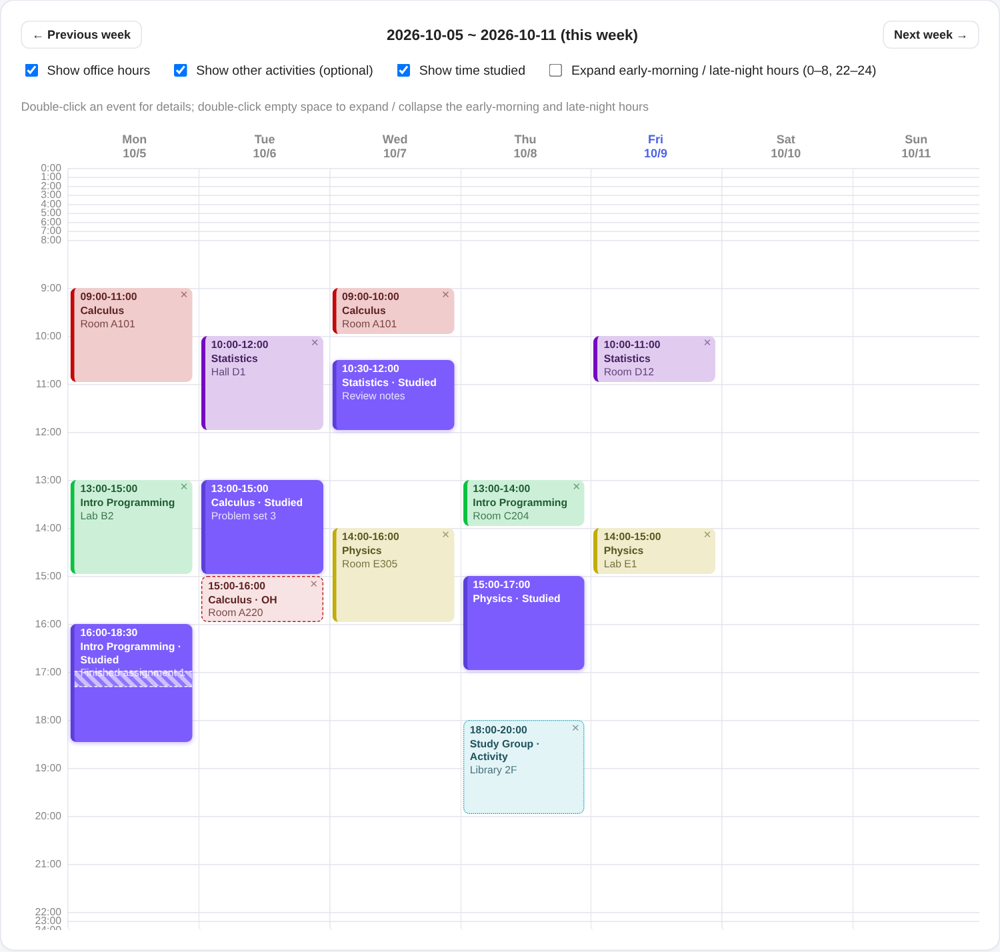
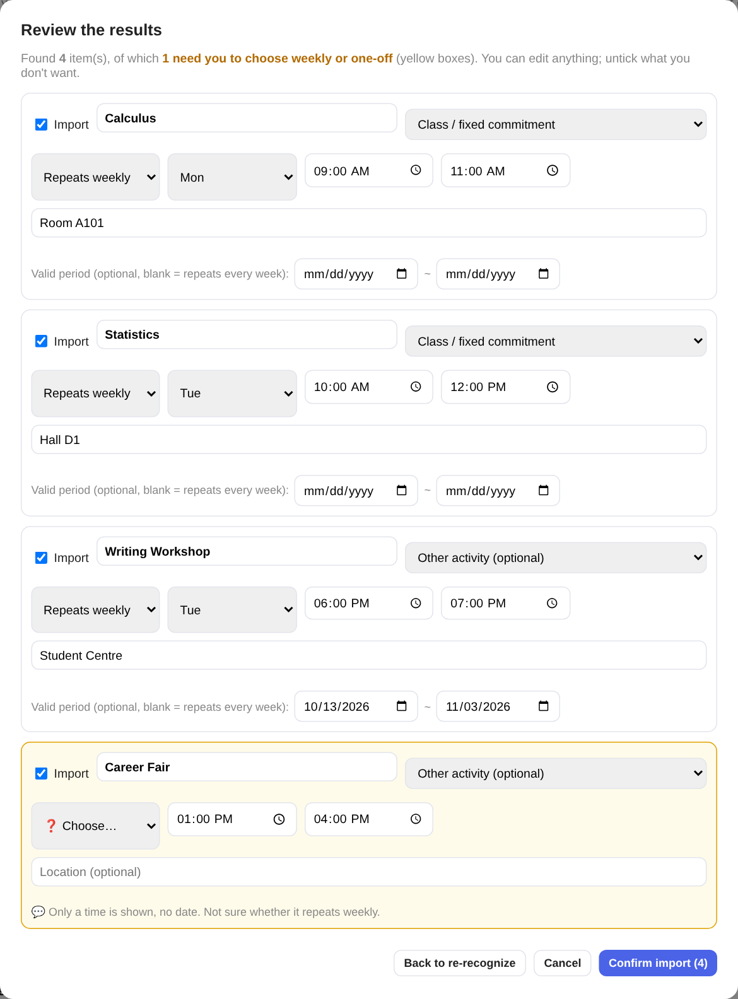

# Study Timer · 课程时间管理

[中文说明 (Chinese README)](README.md)

A study timer plus weekly timetable for students. Track how long you spend on each course and see it next to your class schedule, all in one weekly calendar.

**All your data stays on your own computer (in your browser). No account is needed and nothing is uploaded to any server.** (Only when you choose to use AI import are your image or text sent to Anthropic for recognition. See the privacy section below.)

> The interface comes in both English and 中文. Use the drop-down at the top right to switch. On your first visit it follows your browser's language.



## Features

- **Timer**: start / pause / resume / stop, with a note for each session
- **Weekly calendar**: classes, office hours, optional activities, exams, and the time you actually studied
- **Pauses are recorded**: a paused stretch shows as diagonal stripes inside one continuous study block, and the paused time is subtracted from the study time
- **📷 AI import**: upload a screenshot or a photo of a handwritten timetable, or paste text. The AI reads it, and nothing is saved until you confirm (see below)
- Edit a record's time, course and note. Deleted records stay in "Recently deleted" for 10 days
- Early-morning (0–8) and late-night (22–24) hours are collapsed by default. Double-click empty space to expand them
- Back up and restore with a JSON file
- **English / 中文 interface**: switch with the drop-down at the top right; your choice is remembered in the browser and your data works in both languages

## How to use

### 0. Don't want to download? Try it online

Open the **[online demo](https://wsttiffanywu-oss.github.io/study-timer/)** and use it right away, nothing to download. It is the same program as the download, and your data stays in your own browser only (nothing is uploaded to any server). Use the drop-down at the top right to switch between English and 中文.

> The online version and the downloaded version do not share data. The online version keeps its data in that web page's own storage, so it disappears if you switch browsers or clear site data; use "Export JSON backup" to keep anything important. For long-term use, download the zip below.

### 1. Download and open

1. Open the [Releases page](../../releases/latest) of this repository and download **study_timer.zip** (the English version; 中文版是 `xuexi_jishiqi.zip`，显示名为"学习计时器")
2. Unzip it to any folder
3. Double-click `index.html` to open it in your browser (Chrome or Edge recommended)

The two zips are the same app with the interface language fixed (no language drop-down). If you want the source code, or want to modify it, use the green **Code** button → **Download ZIP** instead; that is the full source with the English / 中文 switch.

> The first time you open it you need to be online once, to load the database component (sql.js).

#### Mac desktop app (testing)

On a Mac you can also install it as a separate app, with no browser and no unzipping:

1. On the [Releases page](../../releases/latest) download **Study Timer for Mac (.dmg, English)** (中文版: `xuexi_jishiqi-mac.dmg`). It works on both Intel and Apple silicon Macs.
2. Double-click the `.dmg` and drag the app into your **Applications** folder.
3. **The first time you open it, macOS will block it**, because the author has no paid Apple developer account and the app is not notarized by Apple. To open it anyway: double-click the app, click "Done", then open **System Settings → Privacy & Security**, scroll to the bottom and click **Open Anyway**. After that it opens normally.

Your data is kept in this app's own folder on your computer (`~/Library/Application Support/Study Timer/data`), so clearing browser data does not affect it, and a JSON backup is saved automatically every day in the `backups` folder next to it (the last 30 are kept). The menu **File → Show Data Folder** opens it. The desktop app and the web version do not share data: to move your web data over, click "Export JSON backup" in the web version and "Import JSON backup" in the desktop app.

The desktop app is new and still being tested. It is Mac-only for now; a Windows version has not been made yet.

### 2. Try the demo first

Want to see it filled with data? Go to the **Schedule** tab, click **Import JSON backup**, and choose `demo-data.json` from the folder. It is a made-up timetable. You can delete the items one by one afterwards by opening them in the calendar.

### 3. Add your own timetable

Three ways, pick any:

| Way | Needs an API key | Good for |
| --- | --- | --- |
| **AI import**: screenshot / handwritten photo / text | Yes | The lazy way. Fastest when you have many classes |
| **Add by hand**: the form below the calendar | No | Few classes, or just one or two items |
| **JSON import**: a file in a fixed format | No | Entering many at once, or having your own chat AI generate the file for free (see [below](#no-api-key-use-your-own-ai-to-make-the-json)) |

Without an API key everything except AI import works normally.

## AI import



How it works:

1. On the Schedule tab, click **📷 AI import**
2. Add up to 5 images (click to choose, drag them in, or press Ctrl/⌘ + V to paste a screenshot). You can also paste text or add a few notes
3. Wait a few seconds while the AI lists what it found
4. **You review it**: every item can be edited, and you can untick the ones you don't want. If the AI can't tell whether something repeats weekly or happens once, it is shown in yellow and you must choose before importing
5. Click confirm to actually add the items to your schedule. Items that look like they are already in your schedule are marked and unticked by default

Activities that run for a fixed number of weeks (for example "every Tuesday for 4 weeks") are recognized too. You can edit the start and end dates of the "valid period" on the review screen, and weeks after the valid period no longer show the item.

> The recognition result shown above is a demo only. The AI can make mistakes, especially with handwriting and blurry images. That is why there is a review step before anything is saved. Please always take a look.

### How to get an API key

AI import uses **your own** Claude API key. The cost is charged to your own account. The author cannot see your key and never handles your money.

1. Go to [console.anthropic.com](https://console.anthropic.com), sign up and log in
2. Add a little credit on the Billing page. A few dollars is enough for a lot of personal use
3. Create a key on the API Keys page, then **copy and save it**. You won't be able to see the full key again after closing the page
4. Back in this app, click **⚙️ Settings** at the top right, paste the key and save

Tips:

- Set a monthly spending limit in the console to avoid surprises
- For the actual cost of each recognition, check the Usage page in the console
- Don't send your key to anyone, and don't paste it anywhere public

### Privacy

- Your key is stored only in your own browser's local database. It is not written into backup files, and it is sent only to Anthropic when you use AI import, never anywhere else
- When you use AI import, the images and text you choose are sent from your browser straight to Anthropic for recognition. If your timetable contains anything you don't want to upload, crop it out first or add items by hand instead
- Your study records and the schedule itself are never uploaded
- **Don't save a key on a shared computer.** You can clear it in Settings when you're done
- In the desktop app the key is kept in the database file in the app's data folder (not encrypted), so don't share that folder with anyone; the daily JSON backups do not contain the key

## No API key? Use your own AI to make the JSON

AI import needs an API key (and a little credit). If you'd rather not pay, you can **ask the chat AI you already use (ChatGPT, Claude, Gemini, etc., the free version is fine) to turn your timetable into a JSON file**, then bring it in with **Import JSON backup**. This route is completely free and needs no key.

**Step 1: send the prompt below to the AI together with your timetable.** The timetable can be plain text; if that AI accepts images, you can send a screenshot instead.

````text
Please turn my timetable into JSON. Output only one JSON code block, with no explanation.

Format:

{
  "courses": ["MAT101", "CSC108"],
  "events": [
    {
      "course": "MAT101",
      "kind": "class",
      "type": "recurring",
      "day": 0,
      "start": "10:00",
      "end": "11:00",
      "loc": "Room 101"
    },
    {
      "course": "MAT101",
      "kind": "exam",
      "type": "oneoff",
      "date": "2026-12-10",
      "start": "09:00",
      "end": "12:00",
      "loc": "Gym"
    }
  ]
}

Rules:
1. kind must be one of: class, officehour, activity (optional activity), exam.
2. type must be recurring (repeats weekly) or oneoff (happens once).
3. recurring items need day: 0 = Monday, 1 = Tuesday, ..., 6 = Sunday. Do not write date.
4. oneoff items need date in the format YYYY-MM-DD. Do not write day.
5. start and end use 24-hour HH:MM, and end must be later than start.
6. For something that repeats weekly for a fixed number of weeks: use recurring and also add "startDate" (the date of the first session) and "endDate" (the date of the last session), both YYYY-MM-DD.
7. Leave out loc if there is none. No id is needed.
8. If something is unclear or you are not sure, do not guess; leave it out of the JSON.

My timetable:
(paste your timetable here, or send a screenshot below)
````

**Step 2: save it as a file.** Copy the JSON the AI gives you into a plain text file (Notepad or any text editor) and save it as `my-timetable.json` (the extension must be `.json`).

**Step 3: import it.** On the Schedule tab click **Import JSON backup** and choose that file. When it finishes it tells you how many items were added and how many had the wrong format and were skipped.

Notes:
- The AI can make mistakes, especially with dates and weekdays, so take a look at the calendar afterwards. A wrong item can be opened and edited or deleted.
- What you send to a chat AI is handled under that AI's own privacy rules and has nothing to do with this project.
- Importing the same file twice does not create duplicate items.

## Where is my data? How do I back it up?

Your data is kept in the local storage of **the browser you use**, which means:

- If you switch browsers or computers, or clear the browser's site data, you will see an empty app
- So please click **Export JSON backup** on the Schedule tab regularly and keep the file somewhere safe
- On a new device, click **Import JSON backup** (it merges and does not overwrite what is already there)

## JSON import format

**Import JSON backup** accepts a file like this. You can also ask any AI tool to generate one in this format for you:

```json
{
  "courses": ["MAT101"],
  "events": [
    {
      "id": "e-example-1",
      "course": "MAT101",
      "kind": "class",
      "type": "recurring",
      "day": 0,
      "start": "10:00",
      "end": "11:00",
      "loc": "Room 101"
    }
  ],
  "records": []
}
```

- `kind`: one of `class`, `officehour`, `activity` (optional activity), `exam`
- `type`: `recurring` (repeats weekly, needs `day`, where 0 = Monday) or `oneoff` (happens once, needs `date` in the format `YYYY-MM-DD`)
- A weekly item can also have `startDate`, `endDate` (valid period) and `excludeDates` (dates to skip)
- `id` can be left out (one is generated); if you do write it, it must be unique
- Items with the wrong format (for example no course name, an invalid time, or `end` not later than `start`) are skipped, and you are told how many after the import

See `demo-data.json` for a complete example.

## FAQ

**It keeps saying "Initializing database…"?**
Check your network. The first time you open it, it needs to be online to load sql.js.

**An error appears after I click "Start recognition"?**
The message says what went wrong. The usual causes are a key that wasn't copied completely, no credit left in your account, or a network problem.

**The recognition result is wrong?**
Add a few notes in the "Text / extra notes" box, for example "This is my Fall 2026 timetable" or "The Wednesday afternoon one is this week only", then click "Back to re-recognize".

**Does it work on a phone?**
So far it has only been tested in desktop browsers.

## Roadmap

- [x] Timer, weekly calendar, pause tracking
- [x] Settings page for your own Claude API key (stored only in your browser, never included in backups)
- [x] AI import: screenshot / handwritten photo / text, with a review step before saving
- [x] Demo data and usage guide
- [x] Manual add form supports a "valid period" for series that run a few weeks
- [x] English and 中文 interface with a switch
- [x] English README
- [x] Online demo page (GitHub Pages)
- [x] Separate Chinese-only and English-only download packages (Releases)
- [x] Mac desktop app (.dmg, data kept in the app's own folder, daily automatic backup)
- [ ] Windows desktop app
- [ ] Phone experience

## License

This project uses the [PolyForm Noncommercial License 1.0.0](LICENSE): the code is public, and you may use, modify and share it for **non-commercial** purposes such as personal study, research and personal use. **Commercial use is not covered by the license.**

To be clear, this is a "source-available" license, not an "open source" license as defined by the OSI. If you'd like to use it commercially, please contact the author first.

## Status

A personal project, still in progress. You're welcome to try it and tell me what doesn't work well.
