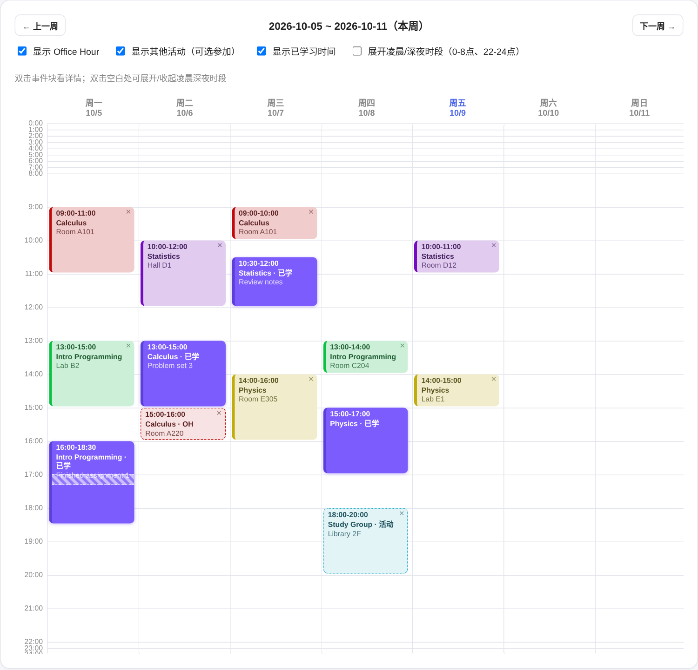
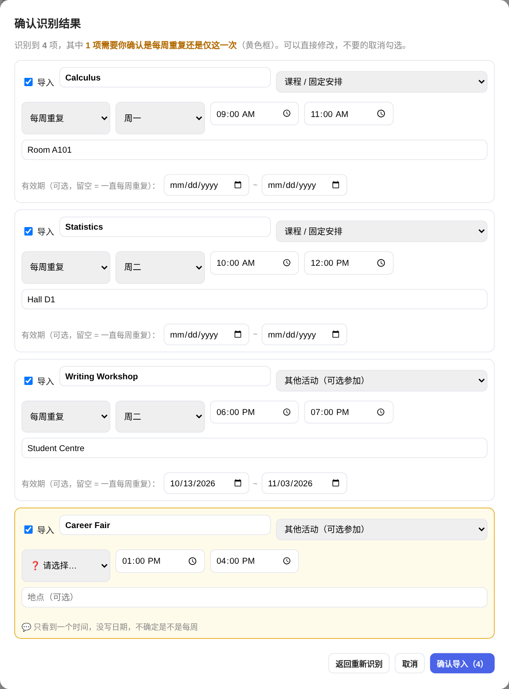

# Study Timer · 课程时间管理

一个给大学生用的学习计时器 + 每周课表。记录你在每门课上花了多少时间，并把它和你的上课安排放在同一张周历里看。

**所有数据都存在你自己的电脑（浏览器）里，不需要注册账号，也不会上传到任何服务器。**（只有你主动使用 AI 导入时，图片或文字才会发给 Anthropic 识别，详见下文隐私说明。）

> 目前界面是中文。英文界面和英文版说明在计划中（见文末 Roadmap）。



## 功能

- **计时器**：开始 / 暂停 / 继续 / 结束，每次可以写备注
- **周历课表**：上课、Office Hour、可选活动、考试，以及你实际学习的时间块
- **暂停会被记录**：暂停的时间段在周历上显示成斜纹，学习块仍然是完整一块，但实际学习时长会扣掉暂停
- **📷 AI 导入课表**：上传课表截图、手写课表的照片，或粘贴文字，AI 识别后先给你确认再写入（见下文）
- 可以修改记录的时间、课程、备注；删除的记录会在"最近删除"里保留 10 天
- 凌晨（0–8 点）和深夜（22–24 点）默认压缩显示，双击空白处可展开
- 用 JSON 文件备份和恢复

## 怎么用

### 1. 下载并打开

1. 点本页右上方绿色的 **Code** 按钮 → **Download ZIP**
2. 解压到任意文件夹
3. 双击 `index.html`，用浏览器打开（推荐 Chrome 或 Edge）

> 第一次打开需要联网一次，用来加载数据库组件（sql.js）。

### 2. 先看看示例

想先看看装满数据是什么样？进入 **课表** 标签，点 **导入JSON备份**，选择文件夹里的 `demo-data.json`，里面是一份虚构的课表。之后可以在课表里点开事项逐条删除。

### 3. 放进你自己的课表

三种方式，任选：

| 方式 | 需要 API key | 适合 |
| --- | --- | --- |
| **AI 导入**：截图 / 手写照片 / 文字 | 需要 | 懒人，课多的时候最省事 |
| **手动添加**：课表页下方的表单 | 不需要 | 课少，或者只想加一两项 |
| **JSON 导入**：按固定格式写文件 | 不需要 | 想批量录入，或者让别的 AI 帮你生成文件（格式见下文） |

不填 API key，除了 AI 导入以外的功能都能正常使用。

## AI 导入课表



流程：

1. 课表页点 **📷 AI导入课表**
2. 上传最多 5 张图片（点击选择、拖进来，或直接 Ctrl/⌘ + V 粘贴截图），也可以粘贴文字，或写几句补充说明
3. 等几秒，AI 把识别到的内容列出来
4. **你来确认**：每一项都可以改，不要的取消勾选。AI 拿不准是"每周重复"还是"仅这一次"的，会标成黄色，必须你选了才能导入
5. 点确认导入，才会真正写进课表。课表里好像已经有的同一项会被标出来，默认不勾选

连续几周的活动（比如"每周二，共 4 周"）也可以识别，确认页里可以直接修改"有效期"的起止日期，过了有效期的周就不会再显示。

> 上图的识别结果仅作演示。AI 会出错，尤其是手写和模糊的图片，所以才设计了"先确认再导入"这一步，请务必看一眼。

### 怎么获得 API key

AI 功能用的是**你自己的** Claude API key，费用由你自己的账户承担，作者看不到你的 key，也不经手你的钱。

1. 打开 [console.anthropic.com](https://console.anthropic.com) 注册并登录
2. 在账单（Billing）页面充值一点额度，个人试用几美元就够用很多次
3. 在 API Keys 页面创建一个 key，**复制并保存**，关掉页面后就看不到完整内容了
4. 回到这个 app，点右上角 **⚙️ 设置**，粘贴 key 并保存

小建议：

- 在控制台设置每月消费上限，避免意外
- 每次识别的实际花费，以控制台里的用量（Usage）页面为准
- 不要把 key 发给别人，也不要贴到公开的地方

### 隐私说明

- 你的 key 只保存在你自己浏览器的本地数据库里，不会写进备份文件，只会在你使用 AI 导入时发给 Anthropic，不会发给其他任何地方
- 使用 AI 导入时，你选的图片和文字会直接从你的浏览器发给 Anthropic 做识别。如果课表里有不想上传的内容，请先裁掉，或改用手动方式
- 学习记录和课表本身从不上传
- **不建议在公共电脑上保存 key**，用完可以在设置里清除

## 数据存在哪？怎么备份？

数据保存在你**所用浏览器**的本地存储里，这意味着：

- 换一个浏览器、换一台电脑、或者清除了浏览器的网站数据，看到的都是空的
- 所以请定期点课表页的 **导出JSON备份**，把文件存好
- 换设备时，在新设备上点 **导入JSON备份** 即可（会合并，不会覆盖已有数据）

## JSON 导入格式

**导入JSON备份** 接受下面这样的文件，你也可以让任意 AI 工具按这个格式帮你生成：

```json
{
  "courses": ["MAT101"],
  "events": [
    {
      "id": "e-example-1",
      "course": "MAT101",
      "kind": "class",
      "type": "recurring",
      "day": 0,
      "start": "10:00",
      "end": "11:00",
      "loc": "Room 101"
    }
  ],
  "records": []
}
```

- `kind`：`class`（课程）、`officehour`、`activity`（可选活动）、`exam` 之一
- `type`：`recurring`（每周重复，需要 `day`，0 = 周一）或 `oneoff`（只有一次，需要 `date`，格式 `YYYY-MM-DD`）
- 每周重复的事项可以再加 `startDate`、`endDate`（有效期）和 `excludeDates`（跳过的日期）
- 每个事项的 `id` 必须唯一

完整的例子见 `demo-data.json`。

## 常见问题

**打开后一直显示"正在初始化数据库"？**
检查网络，第一次打开需要联网加载 sql.js。

**点"开始识别"后报错？**
提示里会写具体原因，常见的是 key 复制不完整、账户没有余额、或网络问题。

**识别结果不准？**
在"补充说明"里写几句，比如"这是 2026 秋季学期课表""周三下午那个只有这一周有"，再点"返回重新识别"。

**手机能用吗？**
目前只在电脑浏览器上测试过。

## Roadmap

- [x] 计时器、周历课表、暂停记录
- [x] 设置页：保存自己的 Claude API key（只存在本机浏览器，不进备份）
- [x] AI 导入课表：截图 / 手写照片 / 文字，先确认再导入
- [x] 示例数据和使用说明
- [ ] 手动添加表单支持"连续几周"的有效期
- [ ] 统一界面语言，提供中文 / 英文切换
- [ ] 英文版 README
- [ ] 在线试用页（GitHub Pages）
- [ ] 手机上的使用体验

## 状态

个人项目，持续开发中。欢迎试用，并告诉我哪里不好用。
